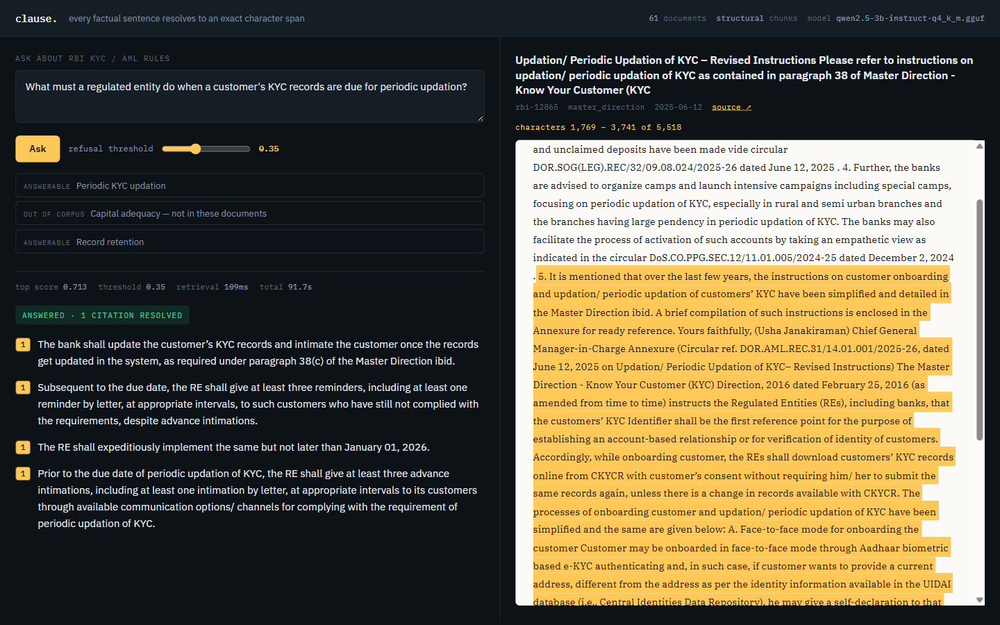

# clause

**A regulatory answer engine where every factual sentence resolves to an exact
character span — not a document, a character range you can go and check.**

Ask a question about Indian banking regulation and you get an answer where each claim
cites `characters 3,209-4,758 of rbi-12866`. The citation's text is sliced out of the
stored document, never written by the model. When retrieval is too weak to support an
answer, the system refuses instead of guessing.



There is a [43-second demo video](docs/video/clause-demo.mp4) in this repo.

## How the citation contract is enforced

The model never supplies citation text. It is shown numbered passages and can only
reference them *by index* — and a GBNF grammar constrains decoding so that an index
outside the range it was given **cannot be generated**. The resolver then reads that
hit's `(doc_id, char_start, char_end)`, loads the stored document, and slices it. A
citation's text is therefore derived from the corpus by construction.

An answer whose citation does not resolve raises and is never returned. There is no
lenient mode and no partial answer, because an answer allowed through with a broken
citation looks exactly like a sound one.

## Measured results

Full report: [`reports/eval.md`](reports/eval.md), regenerated by `make eval` and gated
in CI. Every figure below comes from that committed file.

| strategy | recall@1 | recall@5 | recall@10 | MRR@10 | chance floor |
|---|---:|---:|---:|---:|---:|
| `fixed_window` | 0.23 | 0.446 | 0.51 | 0.319 | 0.084 |
| `structural` | 0.18 | 0.338 | 0.43 | 0.256 | 0.058 |

The **chance floor** is the probability a random top-5 would contain an acceptable
span, computed per strategy over the real answer-span counts. It matters because the
raw ranking and the floor-normalised ranking disagree: `fixed_window` leads on raw
recall, but `structural` is slightly ahead against its own floor. Reading recall
without it would produce the opposite conclusion about which chunker to keep.

`fixed_window`'s raw lead is also partly mechanical — its 200-character overlap
duplicates text, giving it ~43% more acceptable chunks per question (5.91 vs 4.14).

### What does not work

A refusal threshold on the retrieval score **does not separate answerable from
unanswerable questions.** Tested against 15 deliberately unanswerable questions written
to retrieve well:

| threshold | golden answered | golden false-refusals | adversarial refused |
|---:|---:|---:|---:|
| 0.35 | 57 of 65 | 5 | **0 of 15** |
| 0.50 | 33 of 65 | 15 | 3 of 15 |
| 0.70 | 0 of 65 | 28 | 15 of 15 |

There is no setting that keeps the good questions and blocks the bad ones. This is the
project's most useful result: the approach is measurably wrong, and the curve shows
exactly where.

### Limits of the measurement

The golden set's 65 questions are model-drafted; no human verification pass has been
run, and the report states this. Per-bucket `n` is about 16, so one question moves a
bucket by ~6 points. The answering evaluation has not been run to completion — see
`STATUS.md`.

## Stack

Python 3.12 · PostgreSQL · Qdrant · sentence-transformers (ONNX) · llama.cpp with
Qwen2.5-3B · FastAPI · Docker · pytest (363 tests) · ruff · mypy strict · GitHub Actions

See `PROMPT.md` for the full brief, `CLAUDE.md` for the non-negotiables, and
`STATUS.md` for current phase status.

## Running the UI

```bash
docker compose up -d
uv sync --extra answer      # llama-cpp-python, for answering
make serve                  # http://localhost:8000
```

Answering needs a GGUF model in `data/models/` — see "Running the answering
evaluation" below. Retrieval works without it.

## Running Phase 1 locally

Phase 1 covers ingestion and storage: fetch, extract, chunk, and load a corpus of RBI
KYC/AML documents into Postgres. These are the commands, not the results — per
`CLAUDE.md`, no number belongs in this file unless it comes from a committed file
under `reports/`.

**Prerequisites**

- Docker, for the Postgres container.
- `uv`, for the Python 3.12 environment (`requires-python` pins 3.12; do not use a
  bare system `python`).
- A copy of `.env` with `CLAUSE_DATABASE_URL` and `CLAUSE_USER_AGENT` set — copy
  `.env.example` and adjust if needed. `CLAUSE_TEST_DATABASE_URL` in the same file
  must name a *different* database than `CLAUSE_DATABASE_URL`; the test suite builds
  and tears down a schema on it, and running that against the application's own
  database would destroy the ingested corpus.

**Setup**

```bash
uv sync                    # install dependencies (make install)
docker compose up -d       # start Postgres on localhost:5434 (make up)
uv run alembic upgrade head   # build the schema (make migrate)
```

**Ingest the corpus**

```bash
uv run python -m clause.cli ingest --manifest data/corpus/kyc.manifest.jsonl
# or: make ingest (which runs the migration above first)
```

The manifest (`data/corpus/kyc.manifest.jsonl`) is a frozen, committed list of RBI
document URLs and header identities produced by `clause.sources.discover` and
reviewed by hand; ingest does not perform discovery itself. Fetched raw HTML is
cached under `data/raw/` and is fetched at most once per document — deleting a
cached file causes it to be re-fetched live from `rbi.org.in` on the next ingest, so
leave the cache alone unless you intend that.

**Run the tests**

```bash
uv run pytest       # make test
uv run ruff check . # make lint (ruff half)
uv run mypy         # make lint (mypy half)
```

Most of the test suite runs without a warm cache or even a database (unit tests
against fixtures). The acceptance tests in `tests/test_ingest_acceptance.py`
(`pytest.mark.db`) additionally require:

- A reachable Postgres server matching `CLAUSE_TEST_DATABASE_URL` (created
  automatically if it doesn't exist yet, given a reachable server).
- A **warm `data/raw/` cache for every entry in the manifest** — i.e. `make ingest`
  (or the ingest command above) has already been run at least once locally. Without
  it, these tests skip deliberately rather than fetching `rbi.org.in` live, which
  would happen on every CI run and contradicts this project's rate-limiting
  commitment (see `PROMPT.md` section 1, and section 8 of
  `docs/superpowers/specs/2026-09-19-ingestion-and-storage-design.md`).

The test suite builds and tears down its own schema on `CLAUSE_TEST_DATABASE_URL`
via Alembic on every run; it never touches the database at `CLAUSE_DATABASE_URL`.

## Running the evaluation

Phase 2 covers retrieval and evaluation: embed the ingested corpus into Qdrant, run
the golden set against both chunking strategies, and gate CI on a committed
baseline. As in Phase 1, no number belongs in this file — the actual figures live in
`reports/eval.md`, which `make eval` generates and which is committed alongside this
README.

**Prerequisites**

- Everything in "Running Phase 1 locally" above, with the corpus already ingested
  (`make ingest`).
- `docker compose up -d` also starts Qdrant, on the port `CLAUSE_QDRANT_URL` in
  `.env` names (see `.env.example`).

**Warm the embedding model**

The first call into `Encoder` downloads the configured `sentence-transformers`
model and converts it to ONNX; that has nothing to do with `rbi.org.in` and is safe
to run at any time, but it does make the first `make index` or `make eval` after a
fresh environment noticeably slower than every run after it. There is no separate
warm-up command — running either one once populates the local model cache for
every run that follows.

**Index and evaluate**

```bash
make index   # embed every chunk of every strategy into its own Qdrant collection
make eval    # score both strategies against the golden set; writes reports/eval.md
             # and reports/eval.json
```

`make eval` never writes `reports/baseline.json` — see below.

**The CI gate**

```bash
make gate    # or: uv run python -m clause.cli gate
```

This compares the committed `reports/eval.json` against `reports/baseline.json` and
against a fingerprint of the working tree (the manifest, the golden set, the
embedding model, the retrieval depth, and the indexed chunk counts), and fails if
either recall has regressed below the baseline or the report is stale relative to
the tree. `.github/workflows/ci.yml` runs this after the test suite -- the
workflow is configured but has not yet executed anywhere, since no remote is
configured. See `clause.cli._gate_chunk_counts` for the one field it cannot
verify without a real corpus in CI, and why the gate prints that it is skipping
it rather than silently passing.

**Updating the baseline deliberately**

`reports/baseline.json` is a committed, hand-authored file, never an output of
`make eval` — a harness that promotes its own baseline cannot detect a regression.
Update it only as a deliberate act, after reviewing the new `reports/eval.md`:

```bash
uv run python - <<'PY'
import json, pathlib
report = json.loads(pathlib.Path("reports/eval.json").read_text(encoding="utf-8"))
baseline = {
    s: {"recall_at_5": d["overall"]["recall_at_5"]}
    for s, d in report["strategies"].items()
}
pathlib.Path("reports/baseline.json").write_text(
    json.dumps(baseline, indent=2, sort_keys=True) + "\n", encoding="utf-8", newline="\n"
)
PY
```

## Running the answering evaluation

Phase 3 covers answering with enforced citations: a local model drafts an answer
over retrieved passages, every citation is resolved against the corpus or the
answer is rejected outright, and retrieval too weak to answer at all triggers a
refusal instead. This is separate from `make eval` above and is never run in CI:
it needs a multi-gigabyte local GGUF model and takes on the order of tens of
minutes, neither of which belongs in a push-triggered pipeline. As with every
other section here, no number belongs in this file — the actual figures live in
`reports/answers.md`, which `make answer-eval` generates and commits alongside
this README.

**Prerequisites**

- Everything in "Running the evaluation" above, with the corpus already indexed.
- The `answer` extra, which pulls in `llama-cpp-python` (a C++ extension CI does
  not build):

  ```bash
  uv sync --extra answer
  ```

- The GGUF model file itself, fetched by hand into `data/models/` (this process
  never downloads it for you — see `clause.answering.llm.LlamaAnswerer`). The
  path and filename `CLAUSE_ANSWER_MODEL_PATH` names in `.env` must match where
  you put it.

**Run it**

```bash
make answer-eval   # or: uv run python -m clause.cli answer-eval
```

This loads one model instance and reuses it across the whole golden set
(`data/golden/kyc-v1.jsonl`) and the adversarial out-of-corpus set
(`data/adversarial/out-of-corpus-v1.jsonl`), retrieving once per question and
generating only for questions that clear the refusal threshold. Expect on the
order of tens of minutes end to end, dominated by generation rather than
retrieval — budget for one full run, not iterative experimentation. Read
`reports/answers.md` for what it actually measured.
